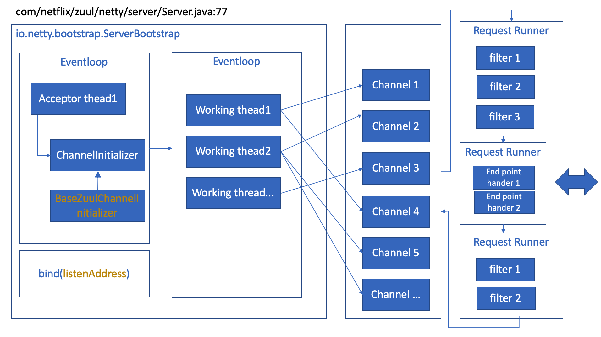
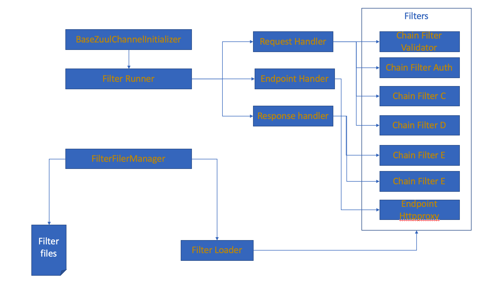

# Zuul Introduction(2)

## Netty Handles

</img>

1. set socket options
2. accepotr threads count
3. workig threads count
4. ip:port
5. ChannelInitializer

## Filters

</img>

1. ZuulServerChannelInitializer
    1. ZuulFilterChainRunner (Request)
    2. ZuulEndPointRunner  (downstream proxy)
    3. ZuulFilterChainRunner (Response)
    4. **shouldFilter(T msg)**;
2. Filter management
   1. FilterFileManager
      1. FilterFileManager
         1. FilterLoader
            1. ZuulFilter
               1. filterName
               2. **filterOrder**
               3. FilterType
                   1. INBOUND
                   2. OUTBOUND
                   3. ENDPOINT

3. EndPointProxy, synchrinzied http client by default
   1. HttpSyncEndpoint
        1. loadbalance is deleted to another netflix component, ribbon.
   2. Healthcheck

## Reqeust processing events

1. CurrentPassport
   1. **PassportState**
        - timestamps
        - events of netty/channel event
        - events of zuul running framework
